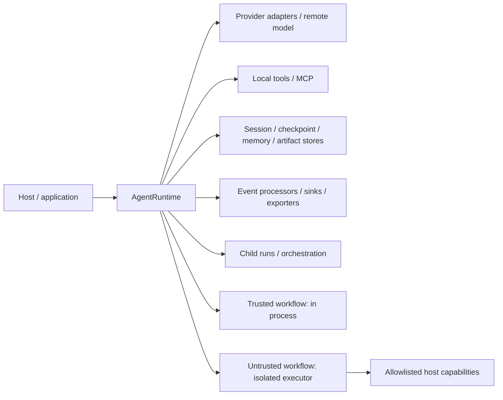

# 支持、安全、SemVer、Threat Model 与 Failure-mode Policy

> 状态：1.0 稳定化治理基线。本文同时记录当前已实现控制与发布前门禁；“要求”不等于当前工作树已经通过远端发布验证。
>
> 当前工作树 package 版本：`1.0.0`。`package.json#exports` 可达的新 subpath 已纳入 public API snapshot gate；npm 发布状态与远端 CI 仍以 release 记录为准。
>
> 相关 ADR：[ADR-006](../adr/ADR-006-workflow-trust-executors.md)、[ADR-007](../adr/ADR-007-event-trace-and-sensitive-data.md)、[ADR-008](../adr/ADR-008-compat-facade-lifecycle.md)、[ADR-009](../adr/ADR-009-node-support-matrix.md)、[ADR-010](../adr/ADR-010-retry-idempotency-exactly-once.md)。

## 1. Policy 目标

这份 policy 回答五个问题：

1. 哪些 Node/OS/package surface 属于支持范围；
2. 何种 API 改动需要 major/minor/patch；
3. SDK 保护哪些资产、信任哪些组件、不防御哪些对手；
4. provider/tool/session/event/workflow/child 失败时有什么数据与副作用保证；
5. 发布者用什么证据证明版本可发布，而不是仅“测试没报错”。

## 2. 支持矩阵

### 2.1 Runtime 与 OS

| Surface | Node | Linux | Windows | macOS | 门禁 |
|---|---|---|---|---|---|
| core/providers/runtime/events/surfaces/orchestration/profiles | 22.13+、24 LTS | blocking | blocking | nightly/manual | typecheck + tests + build |
| package dry-run/subpath exports | Node 22 至少一条 | blocking | 可补充 | 可补充 | `npm pack --dry-run` + clean install/import |
| `/node` 默认 SQLite driver | Node 22.13+ 或 injected driver；24 | blocking | blocking | nightly | storage/migration tests |
| `/workflow` local isolated process | Node 22/24 permission model | blocking | blocking | nightly | security acceptance |
| Electron desktop | bundled Node/ABI + SDK 22/24 build tooling | build | primary | nightly | desktop build/smoke |
| node-pty/xterm | 以 native matrix 为准 | 按 artifact | x64 blocking；arm64 experimental | 按 artifact | 独立 PTY smoke |

`.github/workflows/ci.yml` 当前配置了精确最低 Node 22.13.0/24.0.0、Node 22/24 Linux/Windows 与 macOS nightly。发布人仍必须检查对应 commit 的实际 CI 结果；配置文件不是运行证据。

### 2.2 不支持 / best effort

- Node 18/20 不是新版本支持目标；
- Bun/Deno/浏览器不是完整 runtime 支持目标；纯 type/contract 能否导入不构成 runtime 支持承诺；
- 未列出的 Linux libc/CPU/native dependency 组合为 best effort；
- 非 LTS、nightly Node 为 best effort；
- local-process workflow 不提供 adversarial multi-tenant isolation 保证。

### 2.3 Node 22 小版本注意

`package.json#engines` 已收紧为 `^22.13.0 || ^24.0.0`。`node:sqlite` 在 22.5.0 加入，但到 22.13.0 才不再要求宿主传 `--experimental-sqlite`；SDK 不能替调用方修改进程启动参数，因此 Node 22.0–22.12 不属于 1.0 默认支持范围。CI 既跑精确最低版本，也跑各 major 的当前版本。

### 2.4 支持周期

- 跟随受支持 Node LTS major；移除某 major 至少提前一个 minor release 公告，并在下一个 major 生效，除非上游出现无法安全修复的紧急问题。
- 1.x 至少维护最新 minor；安全修复根据影响回补仍处于维护窗的 minor。
- Preview 0.x 可以修订 contract，但必须提供 changelog、迁移说明和可回滚 adapter。
- Compat root 至少保留一个稳定 major；是否在 2.0 移除必须基于真实迁移数据。

## 3. Semantic Version Policy

### 3.1 Public API 的定义

以下都属于 public contract：

- `package.json#exports` 可达的 runtime value 和 TypeScript type；
- exported class/function/interface/type/enum/constant 名称与签名；
- canonical item `type` 与字段语义；
- error class、`code`、`phase` 和 documented retryability；
- `RunEvent` envelope、schemaVersion、sequence/trace 语义；
- middleware stage 名称与顺序；
- store CAS、checkpoint/resume、tool effect 和 ownership 语义；
- default limits、permission/security default；
- supported Node/OS matrix；
- JSON/SQLite durable schema 与 migration behavior；
- documented package side effects（例如 import-time 不 I/O）。

测试 helper、`@internal` symbol、非 exports 路径不属于支持 surface；用户 deep import 它们不获得兼容保证。

### 3.2 Patch

允许：

- 不改变 public contract 的 bug/security fix；
- 类型声明修正且不使原本有效调用失效；
- provider mapping 修复，保持 canonical 语义；
- 性能/资源泄漏修复；
- 文档与测试补充；
- 更严格地执行已经文档化的安全 invariant。

需要谨慎：安全修复可能让此前错误放行的输入失败。即使发 patch，也必须在 security/change note 中说明。

### 3.3 Minor

允许：

- additive subpath/export、optional field、new canonical item、new provider/profile；
- 新 middleware handler、event type、store adapter；
- deprecated 标记与默认关闭的新 feature；
- 不破坏既有行为的能力扩展。

新增 event/data 字段必须让旧 reader 能忽略；新增必填字段不是 minor。

### 3.4 Major

需要 major：

- 删除/重命名 export、canonical item type、middleware stage；
- 改变 manager-as-tool/handoff ownership；
- 改变 CAS/exactly-once/retry 承诺；
- 把 optional service 变成最小 runtime 默认 I/O；
- 改变安全默认使权限更宽；
- 删除受支持 Node major/OS（按支持周期公告）；
- 删除 compat façade；
- 无 dual reader/migrator 的 durable schema 不兼容变更。

安全默认收紧原则上也应评估生态影响；如果必须紧急发布，可 patch 修复并提供明确诊断/escape hatch，但 escape hatch 不能默认开启。

### 3.5 Preview / pre-1.0 规则

未来若引入显式 preview subpath/feature flag，或维护历史 0.6 分支，每次调整必须：

1. 更新 ADR/changelog/migration guide；
2. 增加 public API diff；
3. 保留至少一条 adapter 或 codemod 路径；
4. 不静默重解释已持久化 state/event；
5. 收集 compat diagnostic 与真实 issue；
6. 在提升为 stable 前冻结 core contracts。

## 4. Deprecation Policy

### 4.1 流程

1. 在类型/JSDoc 标记 deprecated；
2. 在 `/compat` 提供替代 import 和 old→new 示例；
3. 对主要 runtime 入口提供一次性、可关闭 diagnostic；
4. 至少一个 minor 预告，至少一个稳定 major 兼容；
5. 统计调用覆盖率、迁移问题和阻塞场景；
6. major 删除前提供 API diff、migration suite 和 rollback。

### 4.2 当前事实

`configureCompatDiagnostics/getCompatDiagnostics` 已实现，且不联网、不持久化。当前只有 `createAgentSdk` 被记录；不能据此认为所有旧 API usage 已可观测。Legacy message/session/event adapter 已分别通过 `/node`、`/surfaces` 公开；旧 `ActoviqAgentClient` 本身继续由 root/compat façade 提供，不扩张新能力。

## 5. Security Policy

### 5.1 报告与响应

仓库已提供 [`SECURITY.md`](https://github.com/DeconBear/actoviq-agent-sdk/blob/main/SECURITY.md)，首选 GitHub private vulnerability reporting；若仓库侧未启用该功能，报告者只能用不含漏洞细节的公开 issue 请求建立私密渠道。发布者必须在发布前实际验证 private report 能创建和路由，不能把文件或链接本身当作渠道可用证据。

建议分级：

| 等级 | 例子 | 初始响应目标 | 处置 |
|---|---|---:|---|
| Critical | 默认 sandbox escape、跨 tenant 读写、无需授权 RCE/secret exfiltration | 24h | 私密修复、撤销 artifact/凭据、协调披露 |
| High | permission bypass、side-effect 自动重放、path traversal | 3 个工作日 | 优先 patch + security advisory |
| Medium | 需要特殊配置的敏感数据泄漏、可控 DoS | 5 个工作日 | 下个 patch/minor，给 mitigation |
| Low | hardening/documentation gap | 10 个工作日 | backlog + planned release |

这些是发布 policy 目标；只有配置报告渠道、owner/on-call 和演练后才能对外承诺。

### 5.2 Secure defaults

- 最小 agent 不启用 filesystem/network/process/memory/skills；
- Tool 未声明 effect 视为 side-effect；
- 不支持的 model capability 在请求前失败；
- untrusted workflow 无 sandbox executor 时 fail closed；
- `node:vm` 只允许 trusted compatibility；
- child 继承且不能放宽 parent policy/deadline/workspace/budget；
- raw provider response 默认不保留；
- event 进入 sink 前 redaction；
- session/checkpoint/memory/artifact 带 tenant key 和 CAS；
- MCP/tool transport failure 不自动重放 side effect；
- secrets 不进入 state、connection key 明文、event 或日志。

### 5.3 Dependency 与发布供应链

发布门禁：

- lockfile 可复现 `npm ci`；
- dependency audit/许可证检查；
- GitHub Action 固定到受控 major/commit policy；
- `npm pack --dry-run` 检查内容，不包含本地 secret/session/db；
- npm 发布必须启用并归档 provenance/signature 或记录经过批准的替代供应链证据；
- optional native dependencies 单独审计；
- provider/MCP credential 不写入 fixture/snapshot。

## 6. Threat Model

### 6.1 受保护资产

1. Provider/API/MCP auth token、cookie、header、env secret；
2. 用户 workspace、源码、git credential、shell/process 权限；
3. Session、checkpoint、memory、artifact 和 tenant namespace；
4. Tool/MCP/child 的外部副作用；
5. Prompt、模型输出、PII、reasoning/raw provider data；
6. Run event、trace、log 和 exporter backend；
7. Runtime 可用性：CPU、memory、file descriptor、process、network、token/cost budget；
8. Package/build/release integrity。

### 6.2 信任域与边界

边界含义：

- Host 配置、注册 executable tool/middleware/provider，因而是 trusted computing base；
- 模型输出、tool output、MCP server 和外部 workflow source 默认不可信；
- Trusted workflow 被视为与 host 同级，不受 `node:vm` 安全隔离；
- Event sink/exporter 是数据出域；
- Storage adapter 是 durability/tenant 边界，但当前不是身份认证系统；
- Child scope 不能获得比 parent 更宽的 capability。

### 6.3 对手模型

考虑：

- 恶意 prompt/tool output 诱导 policy bypass；
- 恶意/被攻陷 MCP server 返回注入内容或在 timeout 前后执行副作用；
- 恶意 untrusted workflow 读取 env/fs/net/process、耗尽资源或伪造协议；
- 失误或恶意 middleware/tool/provider adapter；
- 并发 writer、崩溃恢复和 stale process；
- 恶意 tenant id/session id/path traversal；
- 慢/失败 event sink 造成阻塞或数据丢失；
- 供应链/optional native dependency 风险。

不承诺防御：

- 已拥有宿主 OS admin/root、同进程任意代码执行或内核控制的攻击者；
- 恶意 trusted workflow/tool/middleware（它们属于 TCB）；
- 未使用 container/remote executor 时的高级 Node/V8/OS escape；
- Host 故意把 secret 放入普通文本字段后，仅依赖 key-based redaction；
- Host 在多个 tenant 间复用同一 authorization/policy 而不做身份验证；
- 外部系统不支持 idempotency 时的 exactly-once side effect。

### 6.4 控制与剩余风险

| 威胁 | 当前控制 | 剩余风险 / Host 责任 |
|---|---|---|
| Provider capability 混用 | capability preflight，不按 hostname | 调用方 capability table 配错仍会错误放行 |
| 无限 run/tool/model/hook/MCP | finite defaults、AbortSignal、deadline | 第三方代码忽略 signal 后可能后台继续 |
| Stream 内存失控 | bounded queue、delta coalescing、terminal reserve | 消费速度/overflow policy 需监控 |
| Same-session 丢写 | per-session serialization、revision/CAS、lock | NFS/非本地锁语义需部署验证 |
| Path traversal | path safety/workspace policy | symlink/TOCTOU 与 host custom tool 仍需防护 |
| Tool permission bypass | ToolPolicy、profile preflight、no-bypass default | 普通 middleware short-circuit invariant 仍需 1.0 强化测试 |
| Side-effect duplicate | effect default side-effect、no implicit replay、checkpoint state | 外部 commit 与 checkpoint 不是原子事务，需要 reconciliation |
| MCP duplicate | transport failure 后 invalidate、不 replay call | server 实际执行状态可能 unknown |
| Workflow secret/fs/process access | untrusted default reject；local process env={}、permission model、capabilities | local process 非强 sandbox；用 container/remote 对抗恶意代码 |
| Event secret leak | key-based redaction before sink、raw opt-in | 普通字段/自由文本中的 secret 不会被自动识别 |
| Cross-tenant storage | tenant composite key、CAS | 逻辑隔离不是 auth/encryption；host 必须鉴权与分库策略 |
| Artifact tamper | sha256、revision/CAS | 当前存储不是加密/签名；DB owner 可改数据 |
| Trace disorder/duplicate | eventId、per-run sequence、trace parent | 跨 run 无全局顺序；sink durable ack 由 adapter 实现 |
| Child fanout | shared budget/concurrency/deadline/cancel | 不受控 custom runtime adapter 可绕开 scope |
| Provider/MCP credential in key/log | hashed fingerprint、redaction policy | 调试日志/custom processor 仍可能泄漏 |

### 6.5 Tenant 与数据保护边界

`tenantId` 是 storage key/trace scope，不是用户身份。Host 必须：

- 在进入 SDK 前认证并授权 tenant；
- 不接受模型自行选择 tenantId/workspace root；
- 规范化 resource id 并限制长度；
- 按合规要求对 SQLite/artifact 进行磁盘加密、备份加密和 retention；
- 为 exporter、provider、MCP 配置 data residency；
- 删除/导出请求要覆盖 session/checkpoint/memory/artifact/event backend；
- 不把 `default` tenant 用于多租户生产。

## 7. Failure-mode Model

### 7.1 保证等级

| 领域 | 保证 | 不保证 |
|---|---|---|
| Session append | CAS；成功返回后 revision 推进；同 session runtime 内串行 | 跨不支持锁的共享 FS 的全局线性一致性 |
| SQLite transaction | 单 DB transaction 内 pending migration 原子 | 与外部 provider/tool 的分布式事务 |
| Checkpoint | 保存 JSON-safe run/pending effect/trace | 外部 side effect exactly-once |
| Provider | capability preflight、有限 retry、stream 首事件后不 replay | 单次计费、远端不重复推理 |
| Local tool | schema/policy/deadline、ToolRunner 不 retry | 忽略 signal 的代码立即停止 |
| MCP tool | timeout/cancel、失败连接失效、call 不 replay | 远端是否已执行可知 |
| Event | per-run sequence/eventId、awaited sink | 跨 run 全局 order、所有 sink exactly-once |
| Child | scope inheritance、bounded budget/concurrency、safe retry policy | side-effect child 自动恢复 |
| Workflow | explicit trust、bounded protocol/output/time | local process 对抗所有 sandbox escape |

### 7.2 详细 Failure-mode 表

| Failure | Detect | SDK 行为 | 数据/副作用状态 | 恢复 |
|---|---|---|---|---|
| Provider 4xx unsupported | CapabilityError 或 transport error | 请求前/立即失败，不 retry 非 retryable | 无 tool side effect | 修 request/model/capability |
| Provider 429/5xx | status/retry-after | 有限 backoff，服从 deadline | 可能多次远端推理/计费 | 观察 usage/cost，必要时 maxRetries=0 |
| Provider stream 中断 | iterator error | 首事件后不 replay | partial output，不自动提交为 final | 新 run 或 provider continuation（若显式支持） |
| Tool validation failure | schema parse | 不调用 tool，生成/抛 validation failure | 无副作用 | 修输入/schema |
| Tool permission deny | ToolPolicy | deny/error result | 无副作用 | 改 policy 或让用户批准 |
| Approval 前进程终止 | checkpoint awaiting_approval | 重启仍等待 decision | 未开始副作用 | load state + approve/reject |
| Tool started 后崩溃 | pending status=started | side-effect 进入 interruption | unknown，可能已提交 | 查询目标系统，reconcile；不盲目 retry |
| Tool completed、结果提交后崩溃 | committed result | resume 补 transcript，不调用 tool | 已提交 | 正常 resume |
| MCP transport failure | call error | invalidate connection，不 replay call | unknown | server/目标系统 reconcile |
| Session CAS conflict | StorageConflictError | 不覆盖 writer | 一方已提交，一方失败 | reload + domain merge/new turn，不盲重试整 run |
| JSON corrupt | schema/data error | fail closed | 源保留 | 从验证备份恢复/人工修复 |
| SQLite ENOSPC/I/O | storage error/transaction failure | 当前 transaction rollback | 先前 commit 保留 | 停写、扩容、integrity check、重试安全 operation |
| Event processor/sink throw | dispatcher error callback | `throw` fail run；`isolate` 继续 | 取决于 sink durable ack | 恢复 sink，replay 只在 sink 自己支持 dedup 时 |
| Slow sink | awaited dispatch latency | 对 run backpressure | event 不丢但 run 变慢 | bounded async adapter/扩容；不可无限 queue |
| Parent abort | AbortSignal | child tree/model/tool/middleware 收到 cancel | started side effect 仍需 reconcile | 等待收敛并检查 unknown |
| Deadline race | absolute boundary | 超时失败/cancel | 同上 | 提高限额前确认不是资源泄漏 |
| Middleware throw | onError stage | recover 或 fail | 依 stage 可能已有 model/tool state | 只在安全可证明时 recover |
| Workflow timeout | executor error | terminate/reap child | capability side effect 可能已发生 | capability 自身用 idempotency/reconcile |
| Workflow protocol overflow | byte/message limit | kill child、fail | 不接受过大 output | 修脚本/转 artifact；不要无限增限 |
| Background stale running | record/revision | read/idempotent 可按 policy恢复；side-effect拒绝 | unknown | reconciliation |
| Child budget exceeded | shared controller | 拒绝新 child / fail policy | 已完成 child 保留 | reducer 处理 partial 或扩大预先批准 budget |
| Agent config digest changed | resume validation | `AGENT_CONFIG_MISMATCH` | checkpoint 保留 | 注册原 spec 或显式 migration，不强 cast |
| Workspace mismatch | profile/scope policy | 运行前失败或拒绝 tool | 无新写入 | 恢复原 workspace 或批准受控迁移 |

### 7.3 Exactly-once 表述规范

对外文档只能使用：

- “不会由 SDK 自动重放该 side-effect call”；
- “checkpoint 可检测 committed/unknown”；
- “配合目标系统持久化 idempotency key 可实现 effectively-once”；
- “需要 reconciliation”。

不得使用：

- “工具 exactly-once”；
- “崩溃后绝不会重复”；
- “事务保证 provider/tool 与 session 原子”；
- “timeout 表示远端没有执行”。

## 8. Resource / Performance Policy

### 8.1 默认上限

Core 默认值以代码为准，当前关键值：maxTurns 32、run 15 分钟、model/tool 120 秒、hook 30 秒、parallel tools 10、subagent depth 1、fanout 8、stream buffer 256。Profile 可以收紧或在受控范围内覆盖。

所有 override 必须为 finite positive value；不能以 `Infinity` 作为新 API 默认。Compat 的历史行为若仍无限，必须 diagnostic。

### 8.2 Baseline 项

1. core import、runtime create/close cold/warm p50/p95；
2. 1/10/100 MCP catalog cold/warm；
3. 10k/100k session append/load/snapshot 与写放大；
4. 100 万 delta 的 peak heap/throughput，buffer 不随总量增长；
5. 1/4/8/16 agent team 的 service instance、connection、fd、heap、token、latency；
6. compaction 前后 CPU/request bytes/token/cost；
7. compat adapter 相对 direct runtime overhead；
8. local isolated workflow process startup/reap latency。

仓库已提供 `bench/runtime`、`bench:runtime:smoke`、`bench:runtime` 与 `bench:runtime:compare`，覆盖 runtime/service、MCP catalog、session、bounded stream、team sharing、compaction 与 compat overhead 等架构指标。CI 的 Linux/Node 22 跑 smoke invariant；完整基线与 compare artifact 应在 release candidate 上归档，不能用普通 unit test 替代。

### 8.3 Regression gate

- core p95、peak memory、session write amplification 相对批准基线回归 >10% 必须解释并审批；
- stream peak memory 由 buffer capacity 决定，不随 event 总数增长；
- warm MCP run 不重复 listTools，除非 TTL/revision/config fingerprint 失效；
- team member 数量增长不能线性增加完整 SDK service instance；
- session append 不重写完整 history；
- 结果需记录硬件、OS、Node、commit、依赖 lock、样本量与统计方法。

## 9. Test / Release Gate

### 9.1 必须通过

- typecheck、unit/integration full suite、build、docs build；
- provider/tool/session/checkpoint/event/orchestration contract suites；
- migration dry-run/apply/idempotent/conflict rollback；
- workflow security acceptance；
- same-session concurrency、bounded stream、abort/deadline、side-effect no replay；
- Node 22/24 Linux/Windows，macOS nightly/manual；
- package dry-run 和 clean tarball import 全 subpath；
- public API diff；
- runtime performance baseline；
- threat/failure review sign-off。

### 9.2 Evidence 要求

每个 gate 保存：command、exit code、commit SHA、Node/OS、关键 count/metric、artifact/CI URL。只写“本地通过”或“没有发现问题”不是 release evidence。

### 9.3 Known release blockers

当前工作树的代码级 blocker 已关闭：Node 22.13 engine 与 exact-minimum CI、统一 surface semantics、固定 middleware stage、handoff/orchestration、runtime benchmark、public API snapshot、package verifier、SECURITY policy 与版本文档均有实现/门禁。发布动作仍必须追踪这些**环境证据**：

- 对应 commit 的 Node 22/24 Linux/Windows blocking CI 与 macOS nightly/manual 实际结果；
- 完整 runtime baseline 与批准基线的 compare artifact；
- 真实数据 session dry-run/shadow/canary/rollback drill；
- 安全与 failure-mode reviewer 签字；
- npm provenance、tarball hash、registry smoke 与发布公告。

Compat diagnostic 目前只统计 `createAgentSdk`，这是已文档化的观测范围，不是 1.0 新 runtime 的发布 blocker；若计划在 2.0 删除更多 root API，必须先扩大统计覆盖。

## 10. Incident / Recovery Policy

### 10.1 发现安全或数据事件

1. 停止新 run/scheduler/spawn 和相关 exporter；
2. 保存 logs/events/checkpoint/DB/compat diagnostic，避免覆盖证据；
3. 轮换 provider/MCP/DB/exporter credential；
4. 标记所有 started/unknown side effect 并 reconciliation；
5. 确认 tenant/workspace 影响范围；
6. 用验证备份恢复，禁止双 writer；
7. 修复后跑全 gate 与 targeted regression；
8. 根据报告 policy 发布 advisory/postmortem。

### 10.2 数据备份最低要求

- JSON v1 source：只读快照 + hash；
- SQLite：关闭连接后的主库备份，或使用 SQLite backup API；不能只复制主文件而忽略 active WAL；
- artifact：bytes + metadata + sha256；
- event backend：按 retention/exporter 能力备份；
- 配置：不把 secret 写入普通备份 manifest；
- 定期 restore drill，而不是只确认备份文件存在。

## 11. Review Checklist

### API reviewer

- [ ] Symbol 是否放在正确 subpath，而不是 root？
- [ ] 是 additive 还是 breaking？
- [ ] Canonical/event/durable schema 是否有 version/dual reader？
- [ ] Default 是否有限且 deny-by-default？
- [ ] Compat adapter、diagnostic、migration/rollback 是否完整？

### Security reviewer

- [ ] Secret 会不会进入 prompt/state/event/log/fingerprint？
- [ ] Tenant/workspace/path 是否由模型可控？
- [ ] Permission/middleware 是否可绕过？
- [ ] Timeout/cancel 后 side effect 状态是什么？
- [ ] Workflow trust tier 是否显式、fail closed？
- [ ] Local process 是否被错误宣传为强 sandbox？

### Reliability reviewer

- [ ] Retry 是否结合 effect/idempotency/commit state？
- [ ] Same-session/multi-process conflict 是否明确？
- [ ] Event/queue/cache/map 是否有上限和清理？
- [ ] Child 是否共享 services/budget/concurrency？
- [ ] 恢复是否可能重放 side effect？

### Release manager

- [ ] Node/OS CI actual run 全绿？
- [ ] package tarball subpath clean import？
- [ ] version/changelog/support docs 一致？
- [ ] API diff 和 perf baseline 已归档？
- [ ] Migration dry-run/rollback drill 已完成？
- [ ] Known blockers 已关闭或明确阻止 release？

## 12. 参考资料

- [OpenAI Agents SDK](https://openai.github.io/openai-agents-python/)
- [Agents / guardrails / output](https://openai.github.io/openai-agents-python/agents/)
- [Running agents](https://openai.github.io/openai-agents-python/running_agents/)
- [Multi-agent orchestration](https://openai.github.io/openai-agents-python/multi_agent/)
- [Human-in-the-loop](https://openai.github.io/openai-agents-python/human_in_the_loop/)
- [Sessions](https://openai.github.io/openai-agents-python/sessions/)
- [Tracing](https://openai.github.io/openai-agents-python/tracing/)
- [Node.js vm 安全边界](https://nodejs.org/api/vm.html)
- [Node.js release status](https://nodejs.org/en/about/previous-releases)
- CrewAI：`E:\BaiduSyncdisk\research\Programming_Development\procontributor\claude_\crewAI`
- DeerFlow：`E:\BaiduSyncdisk\research\Programming_Development\procontributor\claude_\deer-flow`
- DeepAgents：`E:\BaiduSyncdisk\research\Programming_Development\procontributor\claude_\deepagents`
- OpenAI Agents Python：`E:\BaiduSyncdisk\research\Programming_Development\procontributor\claude_\openai-agents-python`
