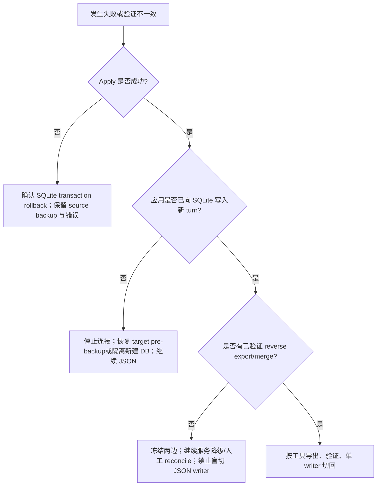

# Session JSON v1 → SQLite 迁移 Dry-run / Cutover / Rollback Runbook

> 当前结论：**代码级 legacy → canonical → Runtime v2 cutover 门禁已通过；生产变更仍是条件 GO。**
>
> `JsonV1Migrator` 在计划阶段把旧 `messages[]` 转为 canonical items，把 `runs[]` 写为仅审计用的 `legacy_run`；`SqliteRuntimeSessionAdapter` 会排除 legacy run 与无法安全跨 provider 重放的 legacy raw block。迁移 fixture 已完成 migrate → load → `AgentRuntime.run()` E2E。
>
> 代码门禁通过不等于某个生产数据集已批准。每次生产 cutover 仍必须完成本 runbook 的 dry-run、备份、shadow/canary、单 writer、rollback drill 与 reviewer 签字；任何未知 legacy shape 都必须 fail closed。
>
> 相关决策：[ADR-004](../adr/ADR-004-durable-store-separation.md)、[ADR-010](../adr/ADR-010-retry-idempotency-exactly-once.md)。

## 1. 适用范围

源目录必须是如下结构，migrator 只扫描直接位于 `sessions` 下的 `.json`：

```text
<sourceDirectory>/
└── sessions/
    ├── <session-a>.json
    └── <session-b>.json
```

每个文件必须：

- 是 JSON object；
- `version === 1`；
- `id` 是非空 string；
- `messages` 和 `runs` 都是 array；
- 所有值可写入 storage JSON。

不在范围：

- JSON v2/未知版本；
- 递归子目录；
- 把旧 run summary 自动变为 runtime checkpoint（当前按 audit record 保存）；
- 在线双写/双向同步；
- 单 session destructive rollback API；
- 加密、跨数据库复制、远程 SQLite；
- 与外部 tool/provider side effect 的事务一致性。

## 2. 当前数据映射与 Runtime 读取规则

### 2.1 已实现的 storage import

| JSON v1 | SQLite storage v2 |
|---|---|
| session `id` | `(tenantId, sessionId)` |
| 除 messages/runs 外的 header | `session.metadata.legacy` |
| format marker | `session.metadata.sourceFormat = actoviq-json-v1` |
| `messages[i].content[j]` | item id `json-v1:message:i:j`、canonical kind/payload、legacy provenance metadata |
| `runs[i]` | item id `json-v1:run:i`、kind `legacy_run`、payload 原样，仅供审计 |
| source file bytes | SHA-256 migration ledger |

Migrator 会：

1. 解析全部源文件并拒绝重复 session id；
2. dry-run 生成 `planned/skipped` 报告；
3. apply 前复制整个 source 到 source 外的 backup directory；
4. 比较 source/backup 与计划时 hash；
5. 在一个 SQLite transaction 中写入全部 pending plan 与 ledger；
6. 保持源文件不变；
7. 相同 sourceId/sourceKey/hash 重跑时 `skipped`；已迁 source 内容变化时失败。

### 2.2 Runtime adapter 的读取边界

旧 message 形状是：

```ts
interface MessageParam {
  role: 'user' | 'assistant';
  content: string | ContentBlockParam[];
}
```

它通常没有顶层 canonical `type`，旧 `runs[]` 也不是 conversation item。因此转换发生在 migration plan 阶段，而不是用 cast 推迟到 model call：

- 合法 message block 被写成 canonical item；
- `legacy_run`/早期 preview 的 `run` 永远不进入 active transcript；
- 未知但 JSON-safe 的 block 被持久化为 `raw { provider: 'legacy' }`，保留审计/导出能力；
- legacy raw 默认不送入 active transcript，因为未知 provider 私有 block 跨 provider 重放不安全；
- 早期 preview 数据库中 verbatim `kind: message` 仍由 adapter 兼容读取；
- 非法 role、非 JSON-safe 值、已知 block 的非法必填字段在 backup/target write 前失败。

### 2.3 已实现的转换规则

当前 converter 规则：

| Legacy content | Canonical item |
|---|---|
| string | `text`，保留 message role |
| text block | `text`，保留 role/text |
| image URL/base64/file block | `image`，保留 role/source |
| `tool_use` | `tool_call`，保留 id/name/input |
| `tool_result` | `tool_result`，保留 callId/status/output |
| `thinking` | `reasoning { provider:'legacy', summary, opaque }`，剔除 signature/encrypted_content |
| unknown JSON block | `raw { provider:'legacy', value }` |
| runs[] | 独立 audit/legacy-run record 或 artifact；不得送入模型 transcript |

实现保留 source/hash/index provenance；转换失败发生在建 plan 阶段，不创建 backup/target session；数据库 apply 失败则整批 transaction rollback。`tests/legacy-session-cutover.spec.ts` 覆盖 migrate → `SqliteRuntimeSessionAdapter.load()` → `AgentRuntime.run()`、tool id、reasoning credential 清理、unknown raw durable/active transcript 排除、legacy run 排除与早期 preview 读取。

`runs[]` 不会转换为 checkpoint，因此旧 run 的中途执行状态不能恢复；只有迁移后的新 Runtime v2 checkpoint 支持 `resume()`。这不是数据丢失：旧 run payload 仍以 `legacy_run` 保存，但它不具备可执行 checkpoint 语义。

## 3. 角色与变更窗口

建议最少两人：

- Operator：执行命令、保存报告、控制 writer；
- Reviewer：核对路径/tenant/sourceId/backup、验证数据与 go/no-go。

维护窗口要求：

- 停止 CLI/TUI/GUI、scheduler、manager、background child 和所有 JSON/SQLite writer；
- 等待或取消 active run；
- reconciliation 任何 started/unknown side effect；
- 不允许 migration 期间 JSON source 变化；
- 不允许目标 SQLite 被另一进程写入。

## 4. 迁移参数表

操作前填写并进入变更记录：

| 参数 | 示例 | 要求 |
|---|---|---|
| Commit / package | `git rev-parse HEAD` | 固定且可恢复 |
| Node | `22.20.0` | 22.13+ 或 24，默认支持 `node:sqlite` |
| `sourceDirectory` | `D:\actoviq-v1` | 绝对 realpath，包含 sessions |
| `sourceId` | `prod-a/session-json-v1/2026-07` | 稳定，不随 mount/path 变化 |
| `tenantId` | `tenant-a` | 不用多租户生产默认值 `default` |
| target DB | `D:\actoviq-v2\state.sqlite` | 绝对路径 |
| source backup | `D:\backup\actoviq-v1-<change-id>` | source 外部、apply 前不存在 |
| target pre-backup | `D:\backup\state-pre-<change-id>.sqlite` | 目标存在时必需 |
| report directory | `D:\migration-reports\<change-id>` | 不含 secret |
| rollback owner/deadline | 姓名/时间 | 预先指定 |

`sourceId` 一旦 apply 不要改变；ledger 以 `(tenantId, sourceId, sourceKey)` 识别同一源。默认 realpath 虽可用，但 source 被移动/重挂载后可能被当成新 source，生产应显式设置。

## 5. 环境与预检

### 5.1 安装与版本

仓库内：

```powershell
npm ci
npm run build
node --version
npm --version
```

已安装 package 的 operator 项目应使用 lockfile 和准确版本，不要迁移当天自动升级依赖。

验证 subpath：

```powershell
node -e "import('actoviq-agent-sdk/node').then(m => console.log(Boolean(m.SqliteStorageV2)))"
```

### 5.2 路径、容量与权限

PowerShell：

```powershell
$Source = (Resolve-Path 'D:\actoviq-v1').Path
$Target = 'D:\actoviq-v2\state.sqlite'
$SourceBackup = 'D:\backup\actoviq-v1-change-123'
$ReportDir = 'D:\migration-reports\change-123'

Test-Path (Join-Path $Source 'sessions')
Test-Path $SourceBackup # apply 前必须 False
New-Item -ItemType Directory -Path $ReportDir -Force | Out-Null
Get-ChildItem (Join-Path $Source 'sessions') -File -Filter '*.json' | Measure-Object
```

检查可用空间至少容纳：完整 source backup + 目标 DB 增量 + 报告 + 安全余量。目录可读、backup/target/report parent 可写。

### 5.3 冻结 writer

应用级停止优先。不要仅凭“看不到进程”推断没有 writer。记录：

- 停止的 service/job/task 名称；
- active run/background 数；
- 最后 JSON 文件 mtime；
- 目标 DB connection owner；
- 停写开始时间。

停止后等待一个观察窗口，再确认 source hash/mtime 不变化。

### 5.4 Source hash manifest

```powershell
Get-ChildItem $Source -Recurse -File |
  Sort-Object FullName |
  Get-FileHash -Algorithm SHA256 |
  Select-Object Path, Hash |
  Export-Csv (Join-Path $ReportDir 'source-before.csv') -NoTypeInformation -Encoding utf8
```

迁移后再次生成并比较。Migrator 自身校验 planned session file 的 hash，但 operator manifest 也覆盖 source 中其他文件。

### 5.5 目标 SQLite 备份

如果 target 已存在，先停止所有 connection。Active WAL 模式下只复制主文件可能不一致；应在关闭连接后复制，或使用经过验证的 SQLite backup API。

关闭连接后的简单离线备份：

```powershell
if (Test-Path $Target) {
  Copy-Item -LiteralPath $Target -Destination 'D:\backup\state-pre-change-123.sqlite' -ErrorAction Stop
}
```

记录 target 原本不存在，或记录 backup SHA-256：

```powershell
Get-FileHash 'D:\backup\state-pre-change-123.sqlite' -Algorithm SHA256
```

## 6. Operator Script

当前 package 没有内建 migration CLI。创建受版本控制/变更记录管理的 `migrate-session-v1.mjs`，不要从聊天记录直接执行未审核片段：

```js
import { readFile, readdir } from 'node:fs/promises';
import path from 'node:path';
import { SqliteStorageV2 } from 'actoviq-agent-sdk/node';

const mode = process.argv[2];
if (!['dry-run', 'apply', 'verify'].includes(mode)) {
  throw new Error('Usage: node migrate-session-v1.mjs <dry-run|apply|verify>');
}

const sourceDirectory = required('ACTOVIQ_MIGRATION_SOURCE');
const filename = required('ACTOVIQ_MIGRATION_TARGET');
const tenantId = required('ACTOVIQ_MIGRATION_TENANT');
const sourceId = required('ACTOVIQ_MIGRATION_SOURCE_ID');
const backupDirectory = process.env.ACTOVIQ_MIGRATION_BACKUP;

const storage = await SqliteStorageV2.open({ filename });
try {
  if (mode === 'verify') {
    const files = (await readdir(path.join(sourceDirectory, 'sessions')))
      .filter(name => name.endsWith('.json'))
      .sort();
    const rows = [];
    for (const name of files) {
      const legacy = JSON.parse(await readFile(
        path.join(sourceDirectory, 'sessions', name),
        'utf8',
      ));
      const loaded = await storage.sessions.load({
        tenantId,
        sessionId: legacy.id,
        afterSequence: 0,
      });
      const expectedItems = legacy.messages.length + legacy.runs.length;
      if (loaded.items.length !== expectedItems) {
        throw new Error(
          `${legacy.id}: expected ${expectedItems}, got ${loaded.items.length}`,
        );
      }
      if (loaded.session.metadata.sourceFormat !== 'actoviq-json-v1') {
        throw new Error(`${legacy.id}: sourceFormat marker missing`);
      }
      rows.push({
        sessionId: legacy.id,
        expectedItems,
        actualItems: loaded.items.length,
        revision: loaded.session.revision,
        lastSequence: loaded.session.lastSequence,
        kinds: loaded.items.map(item => item.kind),
      });
    }
    console.log(JSON.stringify({ mode, tenantId, sessions: rows }, null, 2));
  } else {
    if (mode === 'apply' && !backupDirectory) {
      throw new Error('ACTOVIQ_MIGRATION_BACKUP is required for apply');
    }
    const report = await storage.jsonV1Migration.migrate({
      tenantId,
      sourceDirectory,
      sourceId,
      dryRun: mode === 'dry-run',
      ...(backupDirectory ? { backupDirectory } : {}),
    });
    console.log(JSON.stringify(report, null, 2));
  }
} finally {
  await storage.close();
}

function required(name) {
  const value = process.env[name];
  if (!value?.trim()) throw new Error(`${name} is required`);
  return value;
}
```

安全说明：环境变量中只放路径/tenant/sourceId，不放 provider/MCP secret。Report 仍可能含 session id 与路径，应按内部数据处理。

## 7. Dry-run

### 7.1 设置参数

```powershell
$env:ACTOVIQ_MIGRATION_SOURCE = $Source
$env:ACTOVIQ_MIGRATION_TARGET = $Target
$env:ACTOVIQ_MIGRATION_TENANT = 'tenant-a'
$env:ACTOVIQ_MIGRATION_SOURCE_ID = 'prod-a/session-json-v1/2026-07'
$env:ACTOVIQ_MIGRATION_BACKUP = $SourceBackup
```

### 7.2 执行并保存 stdout/stderr/exit code

```powershell
node .\migrate-session-v1.mjs dry-run 2>&1 |
  Tee-Object -FilePath (Join-Path $ReportDir 'dry-run.log')
$LASTEXITCODE | Set-Content (Join-Path $ReportDir 'dry-run.exit-code.txt')
```

注意：`SqliteStorageV2.open()` 会创建/打开 target 并初始化 schema，所以 dry-run **不是 SQLite 文件零写入**。它保证不创建迁移 backup、不导入 session/item/ledger；测试证据是目标 session 仍不存在。若变更制度要求 dry-run 完全不碰生产 target，请把 target 指向隔离的临时 SQLite，之后删除/隔离临时库。

### 7.3 审核报告

必须满足：

- exit code 0；
- `dryRun: true`；
- 每个未迁文件 status 为 `planned`；已完全相同 ledger 为 `skipped`；
- 文件数等于直接位于 source `sessions/*.json` 的数量；
- `totalItems` 等于所有 `messages.length + runs.length`；
- sessionId 无重复；
- `backupDirectory` 未创建；
- source hash/mtime 未变化；
- target 中无本次 session records。

任何 parse/schema/duplicate/source changed/target conflict 都是 NO-GO，不能通过跳过坏文件继续整批迁移。

## 8. Go / No-Go Gate

### 8.1 允许进行 canonical import

- dry-run 全量通过；
- source writer 已冻结；
- source 与 target pre-backup 已验证；
- backup path 在 source 外且不存在；
- disk space/permissions 足够；
- Operator/Reviewer 同意 tenant/sourceId/file/item counts；
- rollback owner 在线；
- dry-run 中每个 legacy message 已成功转换为 canonical item；未知 block 的处理结果已人工抽样。

### 8.2 旧 session 切 AgentRuntime v2：代码门禁与操作门禁

代码门禁（仓库自动化已覆盖）：

- [x] legacy message → canonical converter 已实现并 contract tested；
- [x] legacy runs 不进入 model transcript；
- [x] unknown block 进入 durable raw 且不丢数据，并从 active transcript 排除；
- [x] tool_use/tool_result id round-trip；
- [x] migrate 后 `SqliteRuntimeSessionAdapter.load()` 成功；
- [x] `AgentRuntime.run()` 使用迁移历史成功；
- [x] 旧/new transcript golden fixture comparison；
- [x] converter 错误发生在 backup/target write 前，apply 冲突整批 rollback；
- [x] dry-run 的 item count 是转换后的 canonical/audit item count，转换错误 fail closed；
- [x] 自动化 rollback fixture 通过。

每个生产变更都必须重新完成，未勾选时仍为 NO-GO：

- [ ] 对真实 source 全量 dry-run，无 parse/schema/duplicate/conflict；
- [ ] source/backup/target pre-backup hash 与恢复命令由 reviewer 复核；
- [ ] shadow transcript 抽样通过，unknown raw 逐项确认；
- [ ] canary 新 turn、CAS、event、usage、restart/resume 通过；
- [ ] 单 writer 路由和 rollback owner 已就位；
- [ ] 该环境的 restore/rollback drill 通过并归档证据。

### 8.3 可选的分阶段策略

风险较高的数据集可以继续采用分代路由：让**全新 session id** 使用 SQLite/AgentRuntime v2，旧 session 保持 JSON/compat，待真实数据抽样通过后再迁。必须按 session generation/namespace 明确路由，禁止同一 session 双 writer。

## 9. Apply（canonical import）

再次确认 backup path 不存在：

```powershell
if (Test-Path $SourceBackup) { throw "Backup path already exists: $SourceBackup" }
```

执行：

```powershell
node .\migrate-session-v1.mjs apply 2>&1 |
  Tee-Object -FilePath (Join-Path $ReportDir 'apply.log')
$LASTEXITCODE | Set-Content (Join-Path $ReportDir 'apply.exit-code.txt')
```

成功报告必须满足：

- `dryRun: false`；
- `backupDirectory` 与审批路径相同；
- planned session 变为 `migrated`；
- 已迁且 hash 相同为 `skipped`；
- `migratedSessions + skippedSessions === files.length`；
- backup 中 session file 与 source hash 相同；
- source 未修改。

Apply 对所有 pending plans 使用一个 SQLite transaction。任一 target conflict/insert 失败时，所有本批 pending target writes 应 rollback；自动创建的 source backup 仍保留。

## 10. Post-import Verification

### 10.1 Storage-level verify

```powershell
node .\migrate-session-v1.mjs verify 2>&1 |
  Tee-Object -FilePath (Join-Path $ReportDir 'verify.log')
$LASTEXITCODE | Set-Content (Join-Path $ReportDir 'verify.exit-code.txt')
```

核对：

- 每个源 session 在正确 tenant 下存在；
- item 数为转换后的 canonical block 数 + legacy run 数；一个 block array message 可产生多个 item；
- sequence 从 1 单调到 lastSequence；
- revision/lastSequence 与报告一致；
- kind 顺序为全部 canonical message blocks 后全部 `legacy_run`；
- metadata.sourceFormat/legacy header 存在；
- 不同 tenant 下同 session id 不可见。

### 10.2 Source/backup hash

```powershell
Get-ChildItem $Source -Recurse -File |
  Sort-Object FullName |
  Get-FileHash -Algorithm SHA256 |
  Select-Object Path, Hash |
  Export-Csv (Join-Path $ReportDir 'source-after.csv') -NoTypeInformation -Encoding utf8

Get-ChildItem $SourceBackup -Recurse -File |
  Sort-Object FullName |
  Get-FileHash -Algorithm SHA256 |
  Select-Object Path, Hash |
  Export-Csv (Join-Path $ReportDir 'backup.csv') -NoTypeInformation -Encoding utf8
```

比较 source-before/source-after，以及 source 相对路径和 backup hash。

### 10.3 Idempotency rerun

使用相同 tenant/sourceId/sourceDirectory 再 apply。所有 file 应 `skipped`、`migratedSessions: 0`、无重复 item；当没有 pending 时不会创建新的 backup。

不要改变 sourceId 来“绕过”ledger；那会把同一 source 当成新迁移并产生冲突/重复风险。

### 10.4 Runtime-level verify

对 canary session 执行独立的 runtime 验证并保存输入快照：

1. `SqliteRuntimeSessionAdapter.load()` 成功，revision 与 storage 一致；
2. canonical text/reasoning/tool items 与 approved golden fixture 一致；
3. `legacy_run` 和 legacy raw 不出现在 provider request；
4. 新一轮 `AgentRuntime.run()` 成功，append 只写增量并推进 CAS revision；
5. 对迁移后新建的 checkpoint 验证 restart/resume；不要尝试把旧 `runs[]` 当 checkpoint；
6. reasoning signature/encrypted content、credential 与 tenant 数据不出现在 request/event/log。

仓库级证据是 [`tests/legacy-session-cutover.spec.ts`](../../tests/legacy-session-cutover.spec.ts)；生产批准必须再用真实数据的脱敏/受控样本执行本节。

## 11. Cutover（仅在本次操作门禁通过后）

本节是条件流程。仓库代码门禁已通过，但任一生产操作门禁未通过时不可执行旧 session cutover。

1. 保持旧 writer 停止；
2. 部署支持 canonical legacy conversion 的 reader/runtime；
3. Shadow read 一组 session，不发 model/tool，比较 canonical transcript；
4. Canary 只读/无 side-effect agent；
5. Canary 新 turn，验证 CAS/revision、event、usage、restart resume；
6. 扩大比例，同时监控 conflict/corrupt/load error/reconciliation/token/latency；
7. 保留 JSON source read-only，不删除；
8. Rollback window 内禁止无工具的双向数据合并；
9. 窗口结束后再制定 archive/retention，不在迁移操作中删除源。

Cutover 期间只允许一个 writer。Shadow 可以 dual-read，不能 dual-write。

## 12. Rollback 决策树



### 12.1 Dry-run 失败

- 不存在 session import，需要修 source/config 后重新 dry-run；
- 如果使用生产 target，open 可能已初始化 schema；按制度保留或隔离该 DB；
- 不删除/修改坏 source 以强行通过，先复制到修复区并记录变更。

### 12.2 Apply 中途失败

- 预期所有 pending target writes 由 transaction rollback；
- 用 storage query 验证本批 first session 不存在/原 conflict session 未改变；
- source 与自动 backup 保留；
- 保存 error code（尤其 `STORAGE_CONFLICT`）、expected/actual revision；
- 修复冲突策略后从 dry-run 重来。

### 12.3 Apply 成功但尚未业务写入

如果 target 在迁移前不存在：关闭所有 connection，把新 DB **移动到 quarantine**，不要立即删除：

```powershell
Move-Item -LiteralPath $Target -Destination "$Target.quarantine-change-123" -ErrorAction Stop
```

如果 target 原本存在：关闭连接，先把当前 DB移到 quarantine，再恢复 target pre-backup：

```powershell
Move-Item -LiteralPath $Target -Destination "$Target.failed-change-123" -ErrorAction Stop
Copy-Item -LiteralPath 'D:\backup\state-pre-change-123.sqlite' -Destination $Target -ErrorAction Stop
```

验证 restored DB hash/integrity 后才恢复原 writer。源 JSON 从未被 migrator 修改，可继续使用。

### 12.4 已有新 SQLite turn 后

当前没有 SQLite → JSON v1 reverse migrator，也没有自动双向 merge。直接切回旧 JSON writer 会丢失/分叉新 turn。

必须：

1. 立即冻结 JSON 与 SQLite writer；
2. 导出新 session/items/checkpoints 作为证据；
3. reconciliation 所有 pending/started side effect；
4. 决定继续修复 SQLite reader，或实现/审核 one-off reverse conversion；
5. 对每个 session 做 revision/transcript/tool correlation comparison；
6. 只有 reviewer 批准且 single-writer 路由验证后才能恢复服务。

因此 cutover 的 canary/rollback window 要尽量短，并先使用无 side-effect workload。

### 12.5 不允许的 rollback

- 运行中复制 active WAL 的单个主 DB 文件；
- 删除 checkpoint 以掩盖 unknown side effect；
- 改 sourceId 重跑；
- 同一 session 同时开 JSON/SQLite writer；
- 用 `as InputItem` 绕过 legacy→canonical 转换；
- 只比较 final text，不比较 tool id/revision/usage/trace；
- 删除 source/backup/quarantine 来“清理现场”。

## 13. 故障与处置速查

| 症状 | 常见原因 | 处置 |
|---|---|---|
| source directory does not exist | 路径/权限/realpath | 修绝对路径与 ACL |
| no readable sessions directory | source 层级错误 | 传包含 `sessions` 的 parent |
| unsupported JSON version | 非 v1/损坏 | NO-GO，单独转换 |
| duplicate session ids | 文件名不同但 JSON id 相同 | 业务决定唯一 id，不能静默覆盖 |
| backup inside source | 路径配置错误 | 选择 sibling/独立 volume |
| backup already exists | 重用路径 | 新 change id/path；不要覆盖旧 backup |
| source changed while backing up | writer 未冻结/磁盘问题 | 停写、重新 hash/dry-run |
| STORAGE_CONFLICT | target session 已存在 | 判断是否同源/不同数据；不要 overwrite |
| previously migrated source changed | sourceId/key 相同但 hash 变化 | 调查变更，不能绕 ledger |
| unknown canonical type | 数据不是合法 v1 或 target 被非 canonical writer 污染 | 保持本次变更 NO-GO，隔离样本；不要 cast/跳过 |
| node:sqlite unavailable | Node <22.13、22.5–22.12 未启用 flag，或 build 不含模块 | 升级 Node 或注入 tested driver |
| ENOSPC/I/O | 空间/权限/介质 | 停写、扩容、验证 DB/source/backup |

## 14. 迁移证据包

每次变更归档：

- change id、operator/reviewer、时间窗；
- commit/package/lockfile hash、Node/OS；
- 完整参数（secret 除外）；
- source-before/source-after/backup hash manifest；
- target pre-backup hash或“不存在”证明；
- dry-run/apply/verify/idempotent rerun stdout、stderr、exit code；
- session/file/item/migrated/skipped counts；
- conflict/corrupt 文件清单；
- storage verification query；
- converter/runtime E2E 与真实数据 shadow/canary 报告；
- cutover/canary metrics；
- rollback drill 结果与最终 go/no-go 签字。

## 15. 自动化验收对应测试

- [`tests/storage-v2-migration.spec.ts`](../../tests/storage-v2-migration.spec.ts)：dry-run 无 session/backup 写入、backup-first、幂等重跑、冲突时整批 rollback、源保留。
- [`tests/storage-v2.spec.ts`](../../tests/storage-v2.spec.ts)：session append/CAS/snapshot、tenant isolation、checkpoint/memory/artifact。
- [`tests/node-checkpoint-adapter.spec.ts`](../../tests/node-checkpoint-adapter.spec.ts)：runtime checkpoint ↔ SQLite。
- [`tests/runtime-session-v2.spec.ts`](../../tests/runtime-session-v2.spec.ts)：canonical session adapter/CAS/same-session serialization。
- [`tests/legacy-session-cutover.spec.ts`](../../tests/legacy-session-cutover.spec.ts)：legacy converter、early-preview reader、unknown raw/legacy run filtering，以及迁移历史上的下一轮 Runtime run。

自动化证明的是仓库 fixture 与事务失败回滚；它不替代生产数据的 dry-run、shadow/canary 和环境级 restore drill。

## 16. 完成标准

### Canonical import 完成

- dry-run/apply/verify/idempotency 全通过；
- source/backup hash 一致；
- target transaction/ledger/count 验证通过；
- source 保持只读；
- 目标 metadata 标记 `sourceFormat = actoviq-json-v1`，canonical/audit item counts 与报告一致。

### 业务 cutover 完成（按环境逐次批准）

- converter/adapter/E2E 门禁全部通过；
- canary 和 restart/resume 通过；
- old/new transcript/tool/usage/event 对照通过；
- 单 writer 路由生效；
- rollback drill 通过；
- 观察窗内无 data loss、unexpected conflict、unknown side effect；
- reviewer 批准；
- JSON source 按 retention archive，而非迁移时删除。

## 17. 参考

- [SDK v2 迁移指南](./09-sdk-v2-migration-guide.md)
- [支持、安全与 failure-mode policy](./10-support-security-semver-and-failure-model.md)
- [OpenAI Agents SDK：Sessions](https://openai.github.io/openai-agents-python/sessions/)
- 本地参考：`E:\BaiduSyncdisk\research\Programming_Development\procontributor\claude_\openai-agents-python`
- 本地参考：`E:\BaiduSyncdisk\research\Programming_Development\procontributor\claude_\deer-flow`
